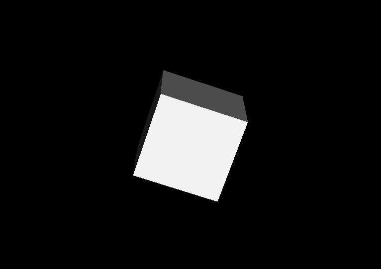

# 3D Engine
Experimental build of a 3d engine from the ground-up.<br/><br/>

<br/>
Rendering a rotating cube with constant shading.<br/><br/>

## Dependencies

- [SDL2](https://libsdl.org)
- [CMake](https://cmake.org)

## Compilation

### Pre-made scripts (linux)
You may need to give execution permission to the files:
```bash
chmod a+x <file_name>
```
#### build and run
```bash
./run -b
```
#### build
```bash
./buildit
```
#### run
```bash
./run
```

### Manual (linux)

#### build
```bash
mkdir -p build && cd build
cmake .. 
make 
```

#### run
```bash
./build/proj
```


